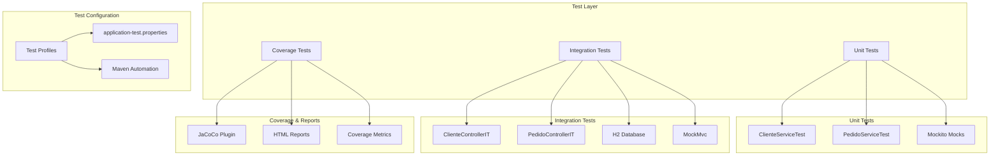

# Design Document - Sistema de Testes Unitários e Integração

## Overview

Este documento descreve o design técnico para implementação de um sistema completo de testes unitários e de integração para a API DeliveryTech. O sistema incluirá testes para serviços (ClienteService e PedidoService), controladores (ClienteController e PedidoController), configuração de cobertura de código com JaCoCo, e automação da execução de testes.

## Architecture

### Testing Architecture Overview



### Test Strategy

1. **Unit Tests**: Isolados, rápidos, focados na lógica de negócio
2. **Integration Tests**: End-to-end, validação completa de APIs
3. **Coverage Analysis**: Monitoramento de qualidade e cobertura
4. **Test Automation**: Execução automatizada via Maven

## Components and Interfaces

### 1. Unit Test Components

#### ClienteServiceTest
```java
@ExtendWith(MockitoExtension.class)
class ClienteServiceTest {
    @Mock private ClienteRepository clienteRepository;
    @Mock private ModelMapper modelMapper;
    @InjectMocks private ClienteService clienteService;
    
    // Test methods following naming convention:
    // should_ReturnExpectedResult_When_ConditionMet
}
```

**Test Scenarios:**
- `should_SaveCliente_When_ValidDataProvided()`
- `should_ThrowDuplicateException_When_EmailAlreadyExists()`
- `should_ReturnCliente_When_ValidIdProvided()`
- `should_ThrowNotFoundException_When_ClienteNotFound()`
- `should_ReturnActiveClientes_When_ListingWithPagination()`

#### PedidoServiceTest
```java
@ExtendWith(MockitoExtension.class)
class PedidoServiceTest {
    @Mock private PedidoRepository pedidoRepository;
    @Mock private ClienteServiceInterface clienteService;
    @Mock private ProdutoServiceInterface produtoService;
    @Mock private RestauranteServiceInterface restauranteService;
    @InjectMocks private PedidoService pedidoService;
}
```

**Test Scenarios:**
- `should_CreatePedido_When_ValidProductsProvided()`
- `should_ThrowBusinessException_When_InsufficientStock()`
- `should_CalculateCorrectTotal_When_MultipleItems()`
- `should_UpdateStatus_When_ValidTransition()`
- `should_RollbackTransaction_When_ErrorOccurs()`

### 2. Integration Test Components

#### ClienteControllerIT
```java
@SpringBootTest(webEnvironment = SpringBootTest.WebEnvironment.RANDOM_PORT)
@AutoConfigureTestDatabase(replace = AutoConfigureTestDatabase.Replace.NONE)
@TestPropertySource(locations = "classpath:application-test.properties")
@DirtiesContext(classMode = DirtiesContext.ClassMode.AFTER_EACH_TEST_METHOD)
class ClienteControllerIT {
    @Autowired private TestRestTemplate restTemplate;
    @Autowired private ClienteRepository clienteRepository;
}
```

**Test Scenarios:**
- POST `/api/clientes` - Creation with valid/invalid data
- GET `/api/clientes/{id}` - Retrieval existing/non-existing
- GET `/api/clientes` - Listing with pagination
- PUT `/api/clientes/{id}` - Update operations
- HTTP Status validation (200, 201, 400, 404)
- JSON response structure validation

#### PedidoControllerIT
```java
@SpringBootTest(webEnvironment = SpringBootTest.WebEnvironment.RANDOM_PORT)
@AutoConfigureTestDatabase(replace = AutoConfigureTestDatabase.Replace.NONE)
@TestPropertySource(locations = "classpath:application-test.properties")
@DirtiesContext(classMode = DirtiesContext.ClassMode.AFTER_EACH_TEST_METHOD)
class PedidoControllerIT {
    @Autowired private TestRestTemplate restTemplate;
    @Autowired private PedidoRepository pedidoRepository;
}
```

**Test Scenarios:**
- POST `/api/pedidos` - Complete order creation
- Validation of non-existing products
- Stock validation scenarios
- GET `/api/pedidos/cliente/{id}` - Client history
- PUT `/api/pedidos/{id}/status` - Status updates
- Total value calculations validation
- Error scenarios with standardized payloads

### 3. Coverage Configuration

#### JaCoCo Maven Plugin Configuration
```xml
<plugin>
    <groupId>org.jacoco</groupId>
    <artifactId>jacoco-maven-plugin</artifactId>
    <version>0.8.8</version>
    <executions>
        <execution>
            <goals>
                <goal>prepare-agent</goal>
            </goals>
        </execution>
        <execution>
            <id>report</id>
            <phase>test</phase>
            <goals>
                <goal>report</goal>
            </goals>
        </execution>
        <execution>
            <id>check</id>
            <goals>
                <goal>check</goal>
            </goals>
            <configuration>
                <rules>
                    <rule>
                        <element>CLASS</element>
                        <limits>
                            <limit>
                                <counter>LINE</counter>
                                <value>COVEREDRATIO</value>
                                <minimum>0.80</minimum>
                            </limit>
                        </limits>
                    </rule>
                </rules>
            </configuration>
        </execution>
    </executions>
</plugin>
```

## Data Models

### Test Data Models

#### ClienteTestData
```java
public class ClienteTestData {
    public static ClienteDTO createValidClienteDTO() {
        return ClienteDTO.builder()
            .nome("João Silva")
            .email("joao@email.com")
            .telefone("11999999999")
            .endereco("Rua A, 123")
            .build();
    }
    
    public static Cliente createValidCliente() {
        Cliente cliente = new Cliente();
        cliente.setId(1L);
        cliente.setNome("João Silva");
        cliente.setEmail("joao@email.com");
        cliente.setTelefone("11999999999");
        cliente.setEndereco("Rua A, 123");
        cliente.setAtivo(true);
        return cliente;
    }
}
```

#### PedidoTestData
```java
public class PedidoTestData {
    public static PedidoDTO createValidPedidoDTO() {
        return PedidoDTO.builder()
            .clienteId(1L)
            .restauranteId(1L)
            .enderecoEntrega("Rua B, 456")
            .cepEntrega("01234567")
            .itens(List.of(createValidItemPedidoDTO()))
            .build();
    }
    
    public static ItemPedidoDTO createValidItemPedidoDTO() {
        return ItemPedidoDTO.builder()
            .produtoId(1L)
            .quantidade(2)
            .build();
    }
}
```

### Test Configuration Models

#### TestConfiguration
```java
@TestConfiguration
public class TestConfig {
    
    @Bean
    @Primary
    public ModelMapper testModelMapper() {
        return new ModelMapper();
    }
    
    @Bean
    @Primary
    public Clock testClock() {
        return Clock.fixed(Instant.parse("2024-01-01T10:00:00Z"), ZoneOffset.UTC);
    }
}
```

## Error Handling

### Test Exception Scenarios

#### Unit Test Exception Handling
```java
// Testing business exceptions
@Test
void should_ThrowDuplicateException_When_EmailAlreadyExists() {
    // Given
    ClienteDTO dto = ClienteTestData.createValidClienteDTO();
    when(clienteRepository.findByEmail(dto.getEmail()))
        .thenReturn(Optional.of(new Cliente()));
    
    // When & Then
    assertThrows(DuplicateResourceException.class, 
        () -> clienteService.cadastrarCliente(dto));
}

// Testing validation exceptions
@Test
void should_ThrowValidationException_When_InvalidData() {
    // Given
    PedidoDTO invalidDto = PedidoDTO.builder().build(); // Missing required fields
    
    // When & Then
    assertThrows(ValidationException.class, 
        () -> pedidoService.criarPedido(invalidDto));
}
```

#### Integration Test Exception Handling
```java
@Test
void should_Return400_When_InvalidClienteData() {
    // Given
    ClienteDTO invalidDto = new ClienteDTO(); // Missing required fields
    
    // When
    ResponseEntity<ErrorResponse> response = restTemplate.postForEntity(
        "/api/clientes", invalidDto, ErrorResponse.class);
    
    // Then
    assertThat(response.getStatusCode()).isEqualTo(HttpStatus.BAD_REQUEST);
    assertThat(response.getBody().getType()).isEqualTo("validation-error");
}
```

## Testing Strategy

### Test Isolation Strategy

#### Database Isolation
```java
@DirtiesContext(classMode = DirtiesContext.ClassMode.AFTER_EACH_TEST_METHOD)
@Sql(scripts = "/test-data/cleanup.sql", executionPhase = Sql.ExecutionPhase.AFTER_TEST_METHOD)
```

#### Mock Isolation
```java
@BeforeEach
void setUp() {
    reset(clienteRepository, modelMapper);
}
```

### Test Performance Guidelines

1. **Unit Tests**: < 100ms per test
2. **Integration Tests**: < 5s per test class
3. **Coverage Tests**: < 30s total execution
4. **Memory Usage**: < 512MB for test execution

### Test Naming Convention

```java
// Pattern: should_ExpectedBehavior_When_StateUnderTest
should_ReturnClienteResponseDTO_When_ValidIdProvided()
should_ThrowEntityNotFoundException_When_ClienteNotFound()
should_SaveClienteSuccessfully_When_ValidDataProvided()
should_Return201Status_When_ClienteCreatedSuccessfully()
```

### Coverage Targets

- **Services**: 80% minimum line coverage
- **Controllers**: 70% minimum line coverage
- **DTOs**: 60% minimum line coverage
- **Exceptions**: 90% minimum line coverage

### Test Data Management

#### Test Profiles Configuration
```properties
# application-test.properties
spring.profiles.active=test
spring.datasource.url=jdbc:h2:mem:testdb
spring.datasource.driver-class-name=org.h2.Driver
spring.jpa.hibernate.ddl-auto=create-drop
spring.jpa.show-sql=true
logging.level.org.springframework.web=DEBUG
logging.level.com.deliverytech=DEBUG
```

#### Test Database Schema
```sql
-- test-schema.sql
CREATE TABLE IF NOT EXISTS clientes (
    id BIGINT AUTO_INCREMENT PRIMARY KEY,
    nome VARCHAR(255) NOT NULL,
    email VARCHAR(255) UNIQUE NOT NULL,
    telefone VARCHAR(20),
    endereco TEXT,
    ativo BOOLEAN DEFAULT TRUE
);

CREATE TABLE IF NOT EXISTS pedidos (
    id BIGINT AUTO_INCREMENT PRIMARY KEY,
    cliente_id BIGINT NOT NULL,
    restaurante_id BIGINT NOT NULL,
    status VARCHAR(50) NOT NULL,
    data_pedido TIMESTAMP NOT NULL,
    total DECIMAL(10,2) NOT NULL,
    taxa_entrega DECIMAL(10,2),
    endereco_entrega TEXT,
    cep_entrega VARCHAR(8)
);
```

## Implementation Guidelines

### Maven Dependencies Required
```xml
<!-- JUnit 5 -->
<dependency>
    <groupId>org.junit.jupiter</groupId>
    <artifactId>junit-jupiter</artifactId>
    <scope>test</scope>
</dependency>

<!-- Mockito -->
<dependency>
    <groupId>org.mockito</groupId>
    <artifactId>mockito-core</artifactId>
    <scope>test</scope>
</dependency>

<!-- Spring Boot Test -->
<dependency>
    <groupId>org.springframework.boot</groupId>
    <artifactId>spring-boot-starter-test</artifactId>
    <scope>test</scope>
</dependency>

<!-- TestContainers (Optional) -->
<dependency>
    <groupId>org.testcontainers</groupId>
    <artifactId>junit-jupiter</artifactId>
    <scope>test</scope>
</dependency>

<!-- H2 Database -->
<dependency>
    <groupId>com.h2database</groupId>
    <artifactId>h2</artifactId>
    <scope>test</scope>
</dependency>
```

### Automation Commands
```bash
# Execute all tests
mvn test

# Execute specific test class
mvn test -Dtest=ClienteServiceTest

# Generate coverage report
mvn clean test jacoco:report

# Execute with test profile
mvn test -Dspring.profiles.active=test

# Fail build if coverage < 80%
mvn clean test jacoco:check
```

### Directory Structure
```
src/
├── test/
│   ├── java/
│   │   └── com/deliverytech/delivery/
│   │       ├── service/
│   │       │   ├── ClienteServiceTest.java
│   │       │   └── PedidoServiceTest.java
│   │       ├── controller/
│   │       │   ├── ClienteControllerIT.java
│   │       │   └── PedidoControllerIT.java
│   │       ├── util/
│   │       │   ├── ClienteTestData.java
│   │       │   └── PedidoTestData.java
│   │       └── config/
│   │           └── TestConfig.java
│   └── resources/
│       ├── application-test.properties
│       ├── test-data/
│       │   ├── clientes.sql
│       │   └── cleanup.sql
│       └── logback-test.xml
```

## Quality Assurance

### Code Quality Metrics
- **Cyclomatic Complexity**: < 10 per method
- **Test Coverage**: > 80% for services
- **Test Execution Time**: < 30 seconds total
- **Memory Usage**: < 512MB during tests

### Continuous Integration
- Tests must pass before merge
- Coverage reports generated on each build
- Failed tests block deployment
- Performance regression detection